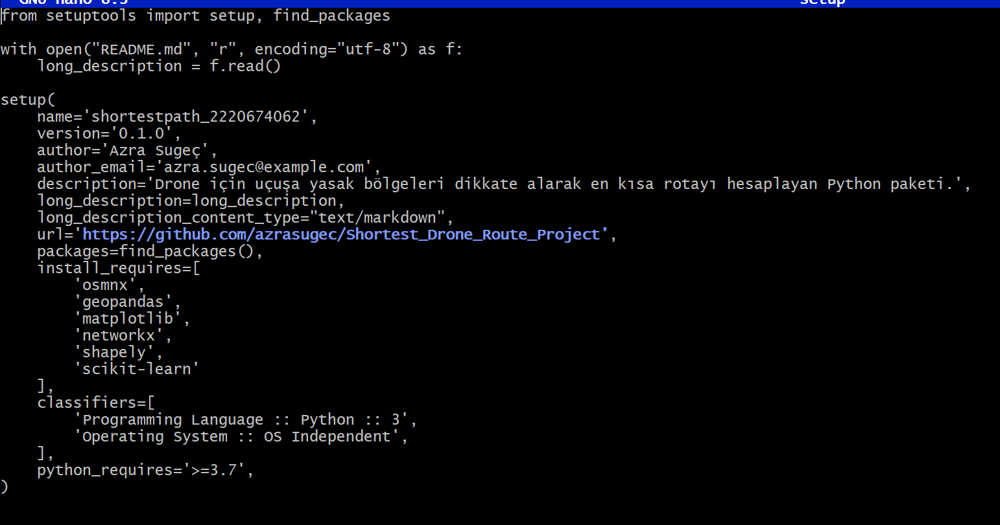

# Shortest Drone Route Project

This project aims to calculate the shortest flight route for a drone while avoiding restricted areas such as military zones, airports, and nature reserves. The data is collected from open-source maps (OpenStreetMap) using Python, and the results are visualized in both matplotlib and QGIS.

The main objectives of the project are:
- Access open geospatial data using OSMnx and GeoPandas
- Identify and extract restricted zones based on specific OSM tags
- Create a navigable road network for drones
- Calculate the shortest path using NetworkX while respecting no-fly zones
- Export the result as GeoJSON for integration with GIS platforms like QGIS

This project is developed as part of a university-level Geomatics Engineering assignment and is packaged in compliance with Python package standards.

---

## Step 1: Project Initialization and Git Setup

The project structure was created using the terminal. Key folders such as `projekodlari`, `tests`, and `.github/workflows` were initialized. Essential files like `README.md`, `requirements.txt`, `setup.py`, and the main Python module were also created.

Then, the project was committed and pushed to GitHub using the following commands:

```bash
git add .
git commit -m "Initial project structure"
git push origin main
```

------
## Step 2: Specifying Project Dependencies
The required Python packages were listed in the `requirements.txt` file. These include libraries for working with graphs, geospatial data, plotting, and testing. This step ensures that all necessary dependencies are available for the project to run smoothly.

The dependencies added were:

osmnx  
networkx  
geopandas  
matplotlib  
shapely  
pytest  
numpy  
scikit-learn

All of these can be installed at once using the following command:

```bash
pip install -r requirements.txt
```

-------
## Step 3: Writing Core Python Functions
At this stage, the main Python file was created (`shortest_drone_route.py`). The logic to download road networks and no-fly zones, visualize them, and calculate the shortest path between two coordinates was implemented using OSMnx, GeoPandas, and NetworkX.

The following key functions were developed:
- `download_map_data()`: Downloads road network and restricted zones
- `plot_map()`: Visualizes the road graph and no-fly areas
- `compute_shortest_path()`: Calculates the shortest route avoiding restricted zones
- `plot_route()`: Displays the computed route
- `export_to_geojson()`: Saves results in GeoJSON format for GIS usage

The `main` section brings all components together and allows the script to run as a complete tool.

  

-------
## Step 4: Running the Python Script and Exporting Route
After completing the function definitions, the Python script was executed. The program printed the computed route length and the node IDs along the path. The final route was successfully exported as a GeoJSON file, which can be imported into QGIS or other GIS tools.

This output confirms that the shortest path calculation worked properly and the route data was correctly generated.


-------
## Step 5: Creating the `setup.py` File
To prepare the project as an installable Python package, a `setup.py` file was created. This file includes metadata such as the project name, version, author, required dependencies, and the link to the GitHub repository.

With this configuration, the project can be packaged and distributed using Python packaging tools.

```bash
python setup.py sdist bdist_wheel
```

This command generates a `dist/` folder with the `.tar.gz` and `.whl` files.



--------

## Step 6: Writing Unit Tests with Pytest
To ensure the reliability of the main functions, unit tests were written using the `pytest` framework. Each key function is tested individually:

- `test_download_map_data()` verifies if the graph and no-fly zone data are retrieved correctly  
- `test_compute_shortest_path()` checks if the route is calculated as a valid list  
- `test_export_no_fly_zones_to_geojson()` and `test_export_route_to_geojson()` confirm that the GeoJSON files are written to disk  

The test file is located at:
`tests/test_shortest_drone_route.py`

All tests can be run using the command:

```bash
pytest
```


--------
## Step 7: Running and Verifying Unit Tests
After writing the unit tests, they were executed using `pytest`. All 4 tests passed successfully, confirming that the core functions — such as data download, path calculation, and file export — are working as intended.

Although two warnings were shown, they are related to future deprecations in external libraries and do not affect the current functionality of the project.

Command used:

```bash
pytest
```


-------

## Step 9: Visualizing the Route in Python
After calculating the shortest path, the route was plotted using matplotlib. The road network is displayed in white, restricted (no-fly) zones in red, and the calculated drone route in blue.

This visualization confirms that the route avoids restricted areas and successfully connects the specified origin and destination.


## Step 10: Visualizing in QGIS
To further verify the accuracy of the route, the exported GeoJSON files (`rota.geojson` and `yasakli_bolgeler.geojson`) were imported into QGIS. The route is clearly seen avoiding restricted areas over real-world satellite and street map layers (OpenStreetMap base layer).

This integration proves the real-world applicability of the route planning algorithm.


---------

## Overview of Libraries and Functions

### 📦 Libraries Used

| Library        | Purpose                                                                 |
|----------------|-------------------------------------------------------------------------|
| `osmnx`        | Download and analyze street network data from OpenStreetMap             |
| `networkx`     | Create and process graph structures for shortest path calculations      |
| `geopandas`    | Handle geospatial vector data using pandas-style syntax                 |
| `matplotlib`   | Plot road networks and visual routes                                    |
| `shapely`      | Work with geometric objects like polygons and lines (used internally)   |
| `scikit-learn` | Required by OSMnx for spatial indexing (e.g., nearest node search)      |
| `pytest`       | Framework for writing and running unit tests                            |
| `os`           | Work with directories and file paths                                    |

---

### ⚙️ Functions Implemented

| Function Name                          | Description                                                                 |
|----------------------------------------|-----------------------------------------------------------------------------|
| `download_map_data()`                  | Downloads road graph and restricted zones using OSM tags                   |
| `plot_map()`                           | Plots the road network with overlaid no-fly zones                          |
| `compute_shortest_path()`              | Computes the shortest route on the graph between two points                |
| `plot_route()`                         | Visualizes the route and overlays restricted zones                         |
| `export_no_fly_zones_to_geojson()`     | Saves the restricted area polygons to a `.geojson` file                    |
| `export_route_to_geojson()`            | Saves the calculated route to a `.geojson` file                            |
| `test_*` functions (in `tests/`)       | Unit tests to verify that each main function works correctly               |

-----------
## Step 8: Debugging Import Errors During Testing
While trying to run the test file using `pytest`, an import error occurred:

```
ModuleNotFoundError: No module named 'projekodlari'
```

This was due to a Turkish character (`ı`) in the folder name (`projekodları`). Python does not recognize this as a valid module name. The issue was resolved by:

- Renaming the folder to `projekodlari` (with regular `i`)
- Adding an empty `__init__.py` file inside the folder to make it a valid Python package

After these changes, the test system recognized the module and tests ran successfully.


---------


## Conclusion

This project successfully demonstrates how open-source geographic data can be used to compute optimized drone flight paths while avoiding restricted areas. From data collection to visualization, each step was carefully implemented and tested using Python-based geospatial tools. The final outputs, both in Python and QGIS environments, confirm the functionality and applicability of the developed system. 

This work serves as a foundation for more advanced spatial analysis and autonomous route planning in real-world applications.


